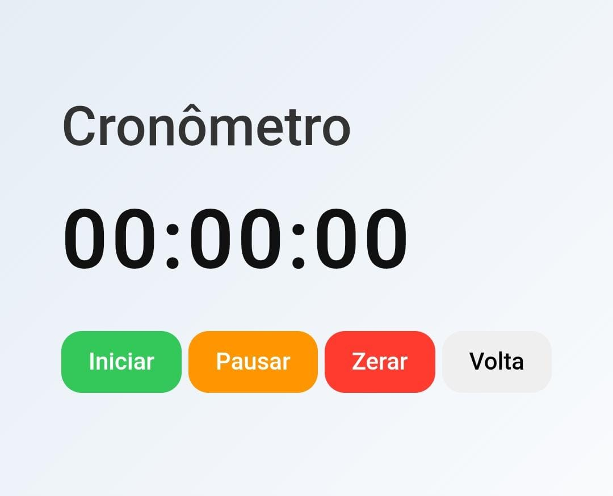

# ⏱️ Cronômetro Web

Aplicação web de um **cronômetro digital** desenvolvida com **HTML, CSS e JavaScript**.
O projeto permite controlar o tempo com funções de **iniciar, pausar, zerar e registrar voltas**, oferecendo uma interface simples e intuitiva.

Este projeto foi criado para praticar **manipulação do DOM, controle de tempo e eventos em JavaScript**, além de trabalhar com organização de layout e estilização moderna.

---

## 🌐 Projeto Online

https://cassymari.github.io/cronometro




---

## 🚀 Funcionalidades

* ▶️ Iniciar o cronômetro
* ⏸️ Pausar a contagem
* 🔄 Reiniciar o tempo
* 🏁 Registrar voltas (Lap Timer)
* ⏱️ Exibição do tempo em **horas, minutos e segundos**
* 🎨 Interface moderna e responsiva

---

## 🛠️ Tecnologias utilizadas

* **HTML5**
* **CSS3**
* **JavaScript**

---

## 📂 Estrutura do projeto

```
cronometro
│
├── index.html
├── style.css
├── script.js
└── README.md
```

---

## ▶️ Como executar o projeto

1. Clone o repositório:

```
git clone https://github.com/cassymari/cronometro.git
```

2. Acesse a pasta do projeto:

```
cd cronometro
```

3. Abra o arquivo **index.html** no navegador.

---

## 🌐 Demonstração

O cronômetro permite acompanhar o tempo em tempo real e registrar voltas durante a contagem, simulando funcionalidades presentes em aplicativos de cronômetro.

---

## 📚 Aprendizados

Durante o desenvolvimento deste projeto foram praticados conceitos como:

* Manipulação do **DOM**
* Uso da função **setInterval()**
* Controle de eventos em JavaScript
* Estruturação de projetos front-end
* Estilização moderna com CSS

---

## 👩‍💻 Desenvolvido por

**Cassy Maria**

🔗 GitHub: https://github.com/cassymari
